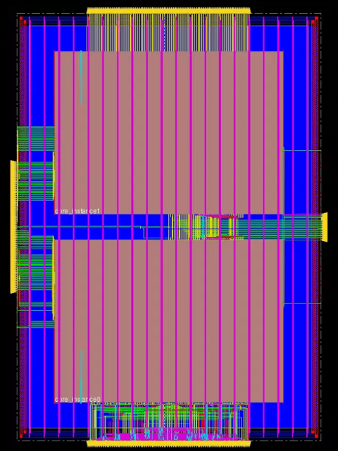
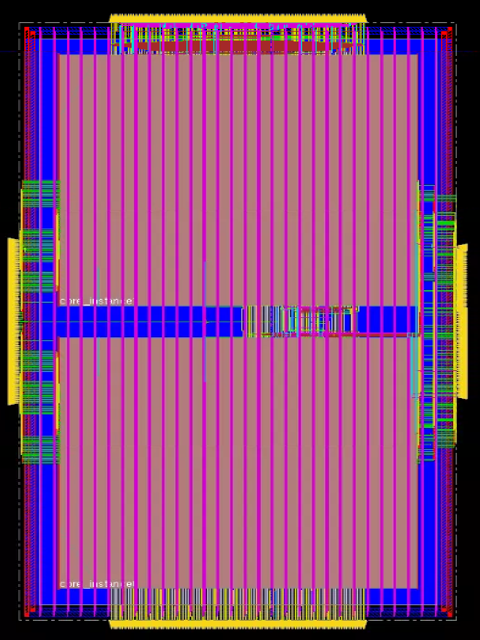

# 1D Vector LLM Accelerator

## Overview

1D Vector LLM accelerator, course project for ECE 260B VLSI Integrated Circuits & Systems Design (Prof. Mingu Kang). 

- The design aims to speed up Q * K calculation of transformers.
- For simplicity, we use normalization instead of SoftMax.
- The results are unsigned number

Tools:

- Synthesis: Design Compiler
- P&R: Innovus
- Gate-level simulation: Xcelium

## File Structure

```
Root Directory
├── scan_chain
│   ├── gate_sim
│   ├── pnr
|   └── syn
├── vanilla
│   ├── gate_sim
│   ├── pnr
|   └── syn
└── images
```

## Post Route Result

|           | vanilla                          | with scan chain                                  |
| --------- | -------------------------------- | ------------------------------------------------ |
| core      |   |   |
| full chip |  |  |

